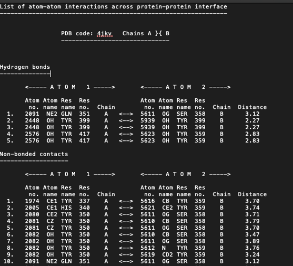
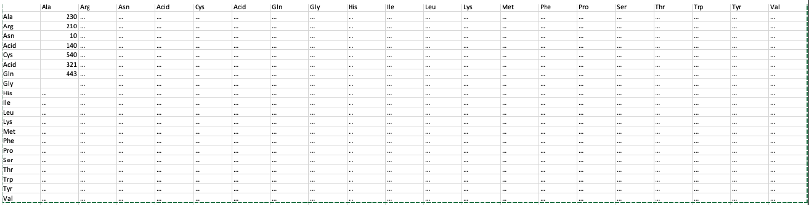

Exercise 2 (Counting Interactions)
You are given a set of txt files that contain information regarding protein interactions. These files are in PDBSum.zip and have the following format:

The file can have 1 or more section: “Hydrogen bonds” , “Non-bonded contacts”, “ Bisulphide bonds”.

**WE ARE ONLY INTERESTED IN “Non-bonded contact”**

This section provides information regarding interacting atoms in each amino acids.

Each line has two similar parts, one for ATOM 1 and one for its interacting complement ATOM 2.

The first column (Atom no.) is the atom number

The second column (Atom name) is the atom name

The third column (Res name) is the amino acid symbol

The fourth column (Res no.) is the amino acid number

The fifth column (Chain) is the Chain in the amino acid is found in

Based on the above figure:

TYR at position 337 in ATOM 1 interacts with TYR at position 359 in ATOM 2

HIS at position 340 in ATOM 1 interacts with TYR at position 359 in ATOM 2

TYR at position 350 in ATOM 1 interacts with SER at position 358 in ATOM 2

TYR at position 350 in ATOM 1 interacts with TYR at position 359 in ATOM 2

GLN at position 351 in ATOM 1 interacts with SER at position 358 in ATOM 2

You need to write a script that will identify for each Amino Acid (Res Name) in Atom 1, its complement amino acid (Res. Name) in Atom 2 and count the number of interactions. Be careful to take into account the amino acid number as well (Res no.).

For instance, based on the figure above,

TYR - TYR : 2 (1 from TYR 337 – TYR 359 and 1 from TYR 350 – TYR 359

HIS - TYR: 1 (from HIS 340 – TYR 359)

TYR – SER: 1 (from TYR 350 – SER 358)

GLN – SER: 1 (from GLN 351 – SER 358)

Notice here that we only take the amino acid and not the atoms when counting. TYR 350 and SER 358 had multiple atoms interacting (5) but we only count it as one interaction. So basically you should take only the unique amino acid (Res name.) and number (Res no.) combination.

**Your script should read and process all the txt files provided at ounce. It should print on the terminal the number of files processed.**

**The script should also compute the interaction number of each amino acid (in all files together and not in each file separate) and write them to a single file “interactionStatistics.txt” with the number of interactions for each Amino Acid (residue). Your file should be also tab delimited and should look like this:**

**NB: The … should be actual numbers!**