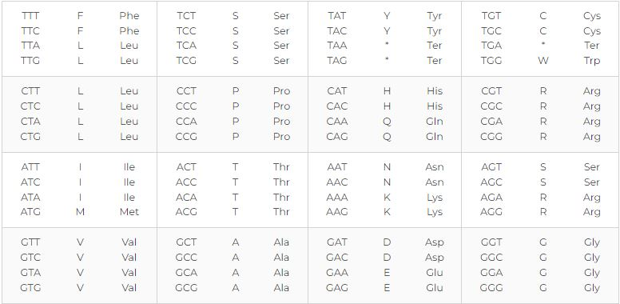

# Exercise 0
## Translate Nucleotides->Codons
You are given a fasta sequence of common nucleotides (they are 4 ACGT). First, write a script that translates the sequence into a sequence of codons. Since codons come in triplets of 3 neucleotides each, we cannot know if the original neucleotide sequence is correct. Therefore, you must create 3 separate sequences where the first sequence assumes correct alignment, the second sequence skips the first nucleotide, and the third sequence skips the first two nucleotides. Use the table given:

## Translate Codons->Nucleotides

Next, write a script that, given the 3 translated codon sequences, must reverse translate them to get the original nucleotide sequence. This is necessarily difficult since each codon could have multiple variation of nucleotide triplets. Finally, output if the original nucleotide sequence was found (there was a unique solution), there is no solution, or if there is no unique solution (show all possible solutions). Finally, you must output if the initial sequence was missing amino acids (the original number of nucleotides was not multiple of 3). If the initial sequence was missing amino acids, you must determine of the sequence disregarding the final gene had a unique solution as well.