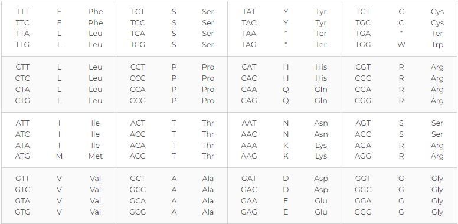

This project contains Python scripts to process txt files, fasta files, and translate and reverse translate codon and nucleotide sequences.

The codon sequence translation table is taken from [here](https://www.genscript.com/tools/codon-table):

